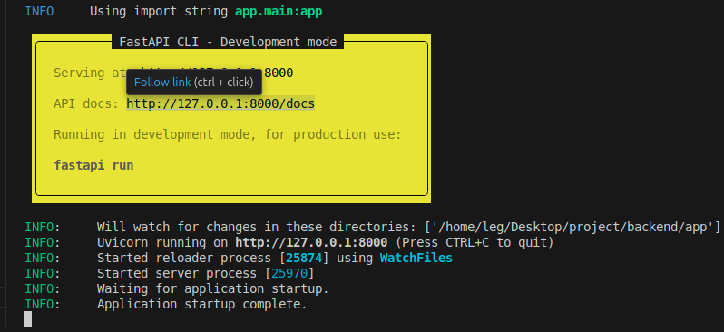
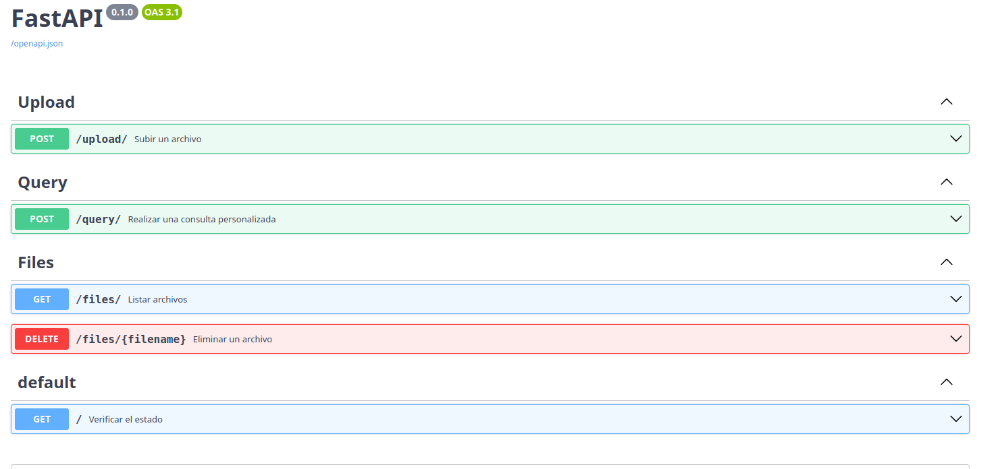
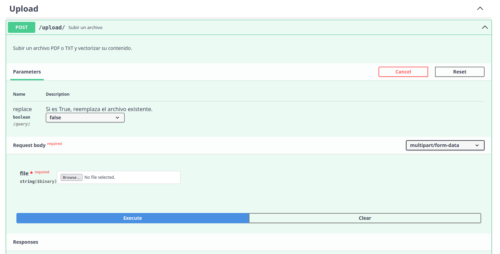
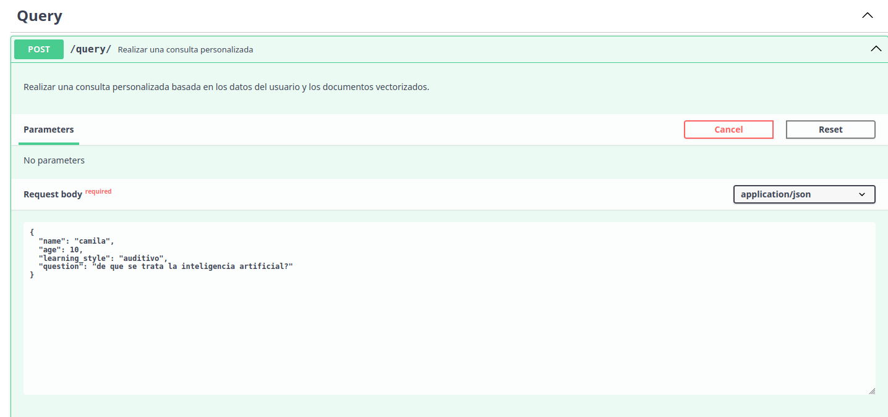

# API Llama-Devs
Una API basada en **RAG (Retrieval-Augmented Generation)** para enseñar inteligencia artificial de forma personalizada a niños, adaptándose a sus estilos de aprendizaje.

---

## 🚀 Características
- Enseñanza personalizada de IA para niños de 5 a 10 años.
- Respuestas adaptadas según estilos de aprendizaje:
  - **Visual**, **Auditivo**, **Kinestésico**, **Lecto-escritura**, y **Juego/Exploración**.
- Uso de una base de datos vectorial para recuperar contenido relevante.
- Generación de respuestas mediante el modelo **Llama-3.2 Vision-Instruct-Turbo**.

---

## 🛠 Requisitos
Antes de instalar, asegúrate de tener lo siguiente:
1. **Python** (versión 3.8 o superior).
2. **PIP** (Administrador de paquetes de Python).
3. **Docker** (Para la base de datos vectorial Qdrant).
4. Una **API Key** de [AIMLAPI](https://aimlapi.com/).

---

## 📦 Instalación

### 1. Configuración de la Base de Datos Vectorial (Qdrant)
Primero, ejecuta un contenedor Docker con Qdrant:

```bash
docker run -d --name qdrant -p 6333:6333 -v qdrant_data:/qdrant_storage qdrant/qdrant
```

Si el contenedor se detiene, puedes reiniciarlo con:
```
docker start qdrant
```

2. Instalar FastAPI

Instala FastAPI con el siguiente comando:
```

pip install "fastapi[standard]"

```
3. Instalar Dependencias del Proyecto

Dentro de la carpeta app, instala las dependencias listadas en requirements.txt:
```

pip install -r requirements.txt
```


4. Configurar Variables de Entorno (OPCIONAL no necesario para entorno de dersarrollo solo para produccion)

Crea un archivo .env en la raíz del proyecto con las siguientes variables:

API_KEY=tu_api_key_de_aimlapi
QDRANT_URL=http://localhost:6333
COLLECTION_NAME=nombre_de_la_coleccion

5. Ejecutar la Aplicación

Inicia la aplicación con:

```
fastapi dev main.py
```

La API estará disponible en: http://localhost:8000 
💻 Uso de la API
Endpoint Principal

    POST /query: Realiza consultas personalizadas adaptadas al estilo de aprendizaje del usuario.

Ejemplo de Cuerpo de Solicitud:

```json

{
  "name": "Juan",
  "age": 8,
  "learning_style": "visual",
  "question": "¿Qué es una red neuronal?"
}

```
Ejemplo de Respuesta:

{
  "answer": "Hola Juan, aquí tienes una explicación visual: Imagina una red neuronal como una serie de puntos conectados por líneas...",
  "sources": ["source1.pdf", "source2.pdf"]
}


📖 Documentación Interactiva

 

FastAPI genera automáticamente documentación para los endpoints:

    Swagger UI: http://localhost:8000/docs
    ReDoc: http://localhost:8000/redoc

   



# upload
Para alimentar el RAG con documentos pdf se debe usar el endpoint POST /upload/
Este es un endpoint de tipo POST que permite subir un archivo a la API. El propósito de este endpoint es subir archivos PDF o TXT para procesar y vectorizar su contenido.

Parámetros de Entrada

  replace (Query Parameter):
        Tipo: boolean (opcional).
        Descripción: Indica si se debe reemplazar un archivo existente.
            Si se establece en true, el archivo que ya existe será reemplazado por el nuevo archivo subido.
            Si se deja como false (valor predeterminado), no se reemplazará ningún archivo existente.

  file (Request Body):
        Tipo: multipart/form-data (requerido).
        Es obligatorio proporcionar un archivo en la solicitud.
        Este archivo debe ser un PDF o TXT.
        Campo: Se selecciona el archivo desde tu sistema local a través del botón "Browse".

Cuerpo de Solicitud (Request Body)

  file (obligatorio):
  Este campo permite subir el archivo que será procesado por la API. Es requerido para que la solicitud sea válida. El campo se muestra en el formato multipart/form-data, lo que significa que soporta la carga de archivos binarios.


# query
POST /query/ Este endpoint es de tipo POST, lo que indica que se envían datos desde el cliente hacia el servidor en el cuerpo de la solicitud. Su objetivo es recibir los datos del usuario (nombre, edad, estilo de aprendizaje) y una pregunta, para generar una respuesta personalizada basada en esos datos y los documentos almacenados en la base de datos vectorial.


Cuerpo de la Solicitud (Request Body)

El cuerpo de la solicitud debe enviarse en formato JSON, con los siguientes campos requeridos:
Estructura del JSON:

```json
{
  "name": "camila",
  "age": 10,
  "learning_style": "auditivo",
  "question": "de que se trata la inteligencia artificial?"
}
```

Después de ejecutar la solicitud, el servidor devuelve una respuesta que puede incluir:

  La respuesta personalizada generada por el modelo:
  Por ejemplo:

```json
{
  "answer": "La inteligencia artificial es una forma en la que las máquinas pueden aprender y realizar tareas que usualmente hacen los humanos, como entender palabras o imágenes.",
  "sources": ["source1.pdf", "source2.pdf"]
}

```
answer: Es la respuesta generada por el modelo, adaptada a los datos del usuario y su pregunta.
sources: Lista de documentos (o archivos) utilizados para construir la respuesta.


